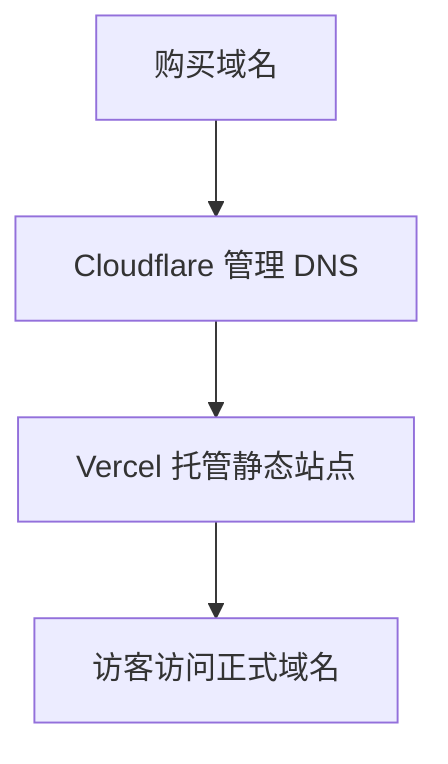

# Building This Site / 建站说明

本页集中记录本站的建站思路、技术路线、工具选择、踩坑经验与后续复盘，便于自己回顾，也便于后来者参考。

!!! abstract "一页看懂"
    本站围绕机械专业知识沉淀而建立，核心思路不是先做复杂网站，而是先搭建一条稳定、可复用、可持续维护的内容工作流：
    `本地写作 -> 版本管理 -> 自动部署 -> 域名访问`

本网站首页采用了 Material for MkDocs 的模板思路（`template: home.html` + `overrides/home.html`），并结合本站内容做了最小化重构。感谢 [Material for MkDocs](https://squidfunk.github.io/mkdocs-material/) 提供的优秀主题与设计参考。

## 建站简述

这个网站的目标不是做“炫技型主页”，而是搭建一个面向机械专业学习与知识沉淀的长期文档站点。对我而言，它至少承担三件事：

1. 作为个人知识库，持续整理机械专业相关内容。
2. 作为公开输出窗口，方便他人阅读、引用与反馈。
3. 作为长期资产，而不是散落在社交平台上的碎片化内容。

目前本站的基本链路是：

`本地写作 Markdown -> Git/GitHub 版本管理 -> 自动化构建部署 -> 自定义域名访问`


对应到具体工具，大致是：

- 内容编写：Markdown
- 本地预览：MkDocs
- 版本管理：Git + GitHub
- 自动化部署：GitHub Actions
- 在线托管：Vercel
- 域名与 DNS：NameSilo + Cloudflare

| 环节 | 主要工具 | 作用 |
| --- | --- | --- |
| 写作 | Markdown、VS Code、Typora | 负责内容生产与结构整理 |
| 预览 | MkDocs | 本地查看页面渲染效果 |
| 版本管理 | Git、GitHub | 记录修改、同步内容、保留历史 |
| 部署 | GitHub Actions、Vercel | 自动构建并发布站点 |
| 访问 | NameSilo、Cloudflare | 域名持有、DNS 解析与访问链路管理 |

## 为什么这样搭建

### 1. 先保证“能写、能改、能积累”

相比一次性做复杂的网站系统，文档站的门槛更低，结构更清晰，更适合长期维护。机械专业内容往往偏知识型、说明型、资料型，Markdown + 文档站的形式比传统企业官网更匹配。

### 2. GitHub 更适合作为内容主仓库

GitHub 的价值不只是“存代码”，更重要的是：

- 它适合做版本管理，能清晰记录每次改动。
- 它适合长期积累，迁移成本相对较低。
- 它具备较强的公开协作属性，更利于技术品牌沉淀。

如果只在网页端修改内容，效率通常不高；而本地写作配合 Git 提交，才是更稳妥的长期方案。

### 3. MkDocs 比传统定制官网更适合个人专业站

对个人专业站而言，核心不是复杂交互，而是：

- 内容结构清晰
- 更新成本低
- 样式专业
- 能长期维护

MkDocs 的优势正好集中在这些方面。它本质上是一个基于 Python 的静态文档站点生成器，而 Material for MkDocs 则提供了成熟、专业、统一的视觉框架。

!!! tip "一句话判断"
    如果核心任务是长期整理专业内容，而不是开发复杂业务系统，那么文档站通常比传统定制官网更合适。

## 我的实际工作流

### 写作与发布流程

日常流程已经比较固定：

1. 在本地用 VS Code 或 Typora 编写 Markdown。
2. 用 `python -m mkdocs serve` 本地预览页面效果。
3. 修改完成后执行 Git 提交与推送。
4. 由自动化流程完成构建与部署。
5. 通过自定义域名对外访问。

对应的常用命令如下：

```powershell
python -m mkdocs serve          # 启动 MkDocs 本地预览服务，默认访问 http://127.0.0.1:8000/
git add .                       # 将当前修改加入暂存区
git commit -m "update content"  # 生成一次带说明的提交记录
git push origin main            # 推送到远端仓库并触发后续部署流程
```

!!! note "这条流程真正重要的地方"
    重点不是记住多少命令，而是形成固定节奏：先本地预览，再提交，再发布。这样排错成本更低，也更适合长期维护。

### 为什么坚持本地写作

本地写作优于直接在网页端修改，原因很现实：

- 可以实时预览 MkDocs 渲染效果。
- 可以批量编辑、全局搜索替换。
- 可以更方便地管理图片、样式和目录结构。
- 可以使用更成熟的编辑器进行复核，减少格式错误。

这一点看似普通，实际上是建站效率差异最大的地方之一。

| 方式 | 优点 | 局限 |
| --- | --- | --- |
| GitHub 网页端修改 | 打开即用，适合临时小改 | 预览弱、批量编辑弱、格式控制弱 |
| 本地写作 + MkDocs 预览 | 可实时预览、适合系统整理、便于统一规范 | 需要本地环境与基础命令习惯 |

## 部署结构的核心理解

### Git、GitHub、本地仓库三者关系

如果用最直白的话概括：

- `Git` 是版本控制工具。
- `GitHub` 是在线仓库平台。
- 本地仓库是你电脑上的工作副本。

常见操作可以理解为：

- `git pull`：把在线更新拉到本地。
- `git add + git commit`：把本地修改整理成一个版本。
- `git push`：把本地版本推到在线仓库。

!!! info "更直观的理解"
    Git 解决的是“版本怎么管理”，GitHub 解决的是“版本放在哪里、如何协作”，本地仓库解决的是“你具体在哪里工作”。

### 自定义域名的意义

自定义域名不是装饰，它意味着这个站点开始具备“正式身份”。

在配置层面，`mkdocs.yml` 中的 `site_url` 应明确写成正式网址，例如：

```yaml
site_url: https://www.bridgezhang.com/
```

它相当于告诉构建系统与搜索引擎：这个地址才是本站的正式入口。

### Vercel、Cloudflare、域名服务商的分工

我对这套关系的理解是：

- 域名服务商负责“你拥有哪个域名”。
- Cloudflare 主要负责 DNS 管理与基础安全能力。
- Vercel 负责把构建后的静态站点稳定托管出来。

从功能上看：

- `DNS` 解决“域名指向哪里”的问题。
- `CDN` 解决“内容如何更高效分发”的问题。

这也是为什么最后不是只停留在 GitHub Pages，而是继续完善了域名、解析与托管链路。



## 建站过程中几个关键经验

### 1. 编辑器差异会直接影响 Markdown 结果

一个非常具体但容易忽略的问题是：有些从 AI 或网页复制来的内容，在记事本类工具中可能会出现 Markdown 语法被异常转义的情况，导致页面渲染不正确。

我的结论是：

- 不要把普通记事本当作 Markdown 终检工具。
- 重要内容最好用 VS Code、Typora 等专业编辑器复核。
- 页面异常时，先检查原始 Markdown 是否被多余符号破坏。

!!! warning "一个容易忽略的小坑"
    从 AI、网页或即时通信工具复制内容时，最常见的问题不是“内容错了”，而是格式被悄悄改坏了。

### 2. GitHub 的可达性与“内容主仓库”价值是两回事

GitHub 作为主仓库依然很有价值，但站点对外访问体验不能只依赖 GitHub Pages。对个人专业网站而言，“内容放在哪里”和“访客如何访问”应分开考虑。

我的做法是：

- GitHub 负责内容版本管理与公开协作。
- 独立域名负责对外统一入口。
- 站点托管与解析链路负责改善访问体验。

### 3. GitHub 与国内同类平台不是替代关系，而是取舍关系

如果目标是参与更广泛的开源生态、建立长期可识别的技术资产，GitHub 仍然更有优势。

如果考虑补充性的国内分发渠道，也可以评估其他平台，但需要重点关注：

- 仓库归属是否清晰
- 协议与版权标注是否规范
- 内容同步机制是否可控

| 关注点 | 更偏向 GitHub 的原因 | 若使用补充平台需注意 |
| --- | --- | --- |
| 公开协作 | 生态成熟、可见度高 | 是否形成重复维护 |
| 技术品牌 | 更容易沉淀长期公开资产 | 仓库归属是否清晰 |
| 内容合规 | 开源语境更成熟 | 协议、版权、同步机制是否规范 |

### 4. 渲染差异不是“写错了”，而是规则不同

GitHub 与 MkDocs Material 对 Markdown 的处理并不完全一致，尤其体现在列表、缩进、超链接样式等方面。

其中有两点特别值得记住：

1. 列表要写得更规范，尤其是嵌套列表前后的空行与缩进。
2. 链接是否带下划线，很多时候不是 Markdown 语法问题，而是 CSS 样式选择问题。

例如，为了让部分链接样式更清晰，我增加了 `docs/stylesheets/extra.css`，并在 `mkdocs.yml` 中引用它。这属于表现层优化，而不是内容层错误。

!!! example "更稳妥的写法习惯"
    子列表前后保留空行，缩进保持一致，能显著减少不同渲染器下的显示偏差。

### 5. 命名规则必须尽早统一

如果文件命名、标题格式和链接路径一开始不统一，后面维护成本会明显增加。

我目前更倾向于以下规则：

- 标题采用 `中文 / American English` 的并列格式。
- 文件名尽量使用英文、小写、连字符。
- 链接路径与文件名保持严格一致。
- 删除草稿性占位内容，不保留类似 `(bridge: ...)` 的临时标记。

这是小事，但小事最容易在后期拖累整个站点。

!!! tip "规则先行的价值"
    早一点统一命名和排版规则，后面每新增一篇文档都会更轻松。

## 工具层面的认识

### Visual Studio Code

VS Code 是本站建设中的主力编辑器。它的意义不只是“能写代码”，还包括：

- 统一管理项目文件
- 配合终端直接运行命令
- 配合扩展处理 GitHub Actions、Markdown 和样式文件
- 与 AI 工具协同，提升整理与排版效率

如果安装时把 VS Code 加入 `PATH`，就可以在终端中直接使用：

```powershell
code .  # 在当前目录中直接打开 VS Code
```

### Python

这里的 Python 主要不是为了做复杂开发，而是作为 MkDocs 的运行基础。

常用检查命令如下：

```powershell
python --version                     # 检查 Python 是否已安装及版本信息
python -m pip install mkdocs-material  # 安装 MkDocs Material 及其依赖
python -m mkdocs --version           # 检查 MkDocs 是否可正常调用
git --version                        # 检查 Git 是否已安装
```

如果环境变量配置不完整，直接使用 `python -m ...` 往往比单独调用 `pip` 或 `mkdocs` 更稳妥。

若依赖安装受网络环境影响，也可以考虑使用合适的国内镜像源。

!!! tip "一个更稳妥的习惯"
    在 Windows 环境中，即使 `python` 已经可用，`pip` 或 `mkdocs` 也不一定能直接作为独立命令使用。

    如果碰到这种情况，优先尝试 `python -m pip ...` 与 `python -m mkdocs ...`，通常更稳定。

#### Python / pip / MkDocs 环境问题极简总结

1. 核心问题往往不是“装没装过”，而是安装类型和 `PATH` 是否正确。
2. 安装 Python 时，应选择完整版安装包，而不是 `Python Install Manager`。
3. 安装过程中，`Add Python to PATH` 是最关键的一步。
4. 环境是否正常，最直接的判断方式是看以下命令能否正常输出：

```powershell
python --version              # 检查 Python 是否可用
python -m pip --version       # 检查 pip 是否可通过 Python 调用
python -m mkdocs --version    # 检查 MkDocs 是否可通过 Python 调用
```

一句话理解就是：命令能不能直接使用，取决于它是否在 `PATH` 中，而不只是“是否安装过”。

### PowerShell

PowerShell 对我来说，不只是“命令输入框”，而是 Windows 下很实用的自动化工具。尤其在处理批量文件任务时，比手工操作可靠得多。

一个实际例子是：我曾使用 PowerShell 脚本批量读取 Word 文档内容并整理输出，这类工作如果完全手动完成，效率会很低。

我对 PowerShell 的基本经验是：

- 先小批量测试，再扩大范围。
- 批量操作前先备份。
- 常用脚本要保留，后续改参数即可复用。
- 涉及中文路径时，要特别注意文件编码。

| 工具 | 我主要用它做什么 | 对本站的价值 |
| --- | --- | --- |
| VS Code | 主编辑器、终端入口、统一管理项目 | 提高写作与维护效率 |
| Python | 支撑 MkDocs 运行 | 让文档站能够本地预览与构建 |
| PowerShell | 批量处理文件、执行自动化脚本 | 节省重复劳动，提升整理效率 |

## 目前形成的几条方法论

建站做到这里，我觉得真正重要的并不是“又会了几个命令”，而是逐步形成了下面这些判断：

- 个人网站首先是内容工程，其次才是页面工程。
- 稳定的工作流，比一次性堆很多功能更重要。
- 本地可预览、可回滚、可复用，是长期维护的基础。
- 把结构、命名、样式规则尽早定下来，后面会轻松很多。
- AI 最适合处理整理、格式化、重写、对比与解释工作，但最终判断仍要靠人自己。

!!! success "复盘后的核心收获"
    真正提升效率的，不是某一个单独工具，而是“内容、工具、流程、规范”开始彼此配合。

## 后续仍可继续完善的方向

目前这个网站已经具备基本可用性，但如果继续迭代，我认为比较值得做的有：

1. 完善站点视觉识别，包括更统一的 logo、favicon 与图表水印体系。
2. 增加投稿、勘误或联系入口，让内容形成更健康的反馈闭环。
3. 继续沉淀格式规范，让新文档写作更模块化、更稳定。
4. 逐步把零散经验整理成“可复用模板”，而不只是停留在一次性记录。

## 写在最后

回头看，建这个网站的过程并不只是“搭了一个站”，更像是把内容生产、工具使用、版本管理、公开表达这几件原本分散的事情，逐步串成了一条线。

如果这份记录对后来者有一点参考价值，那它就已经超出了“备忘录”的意义。
