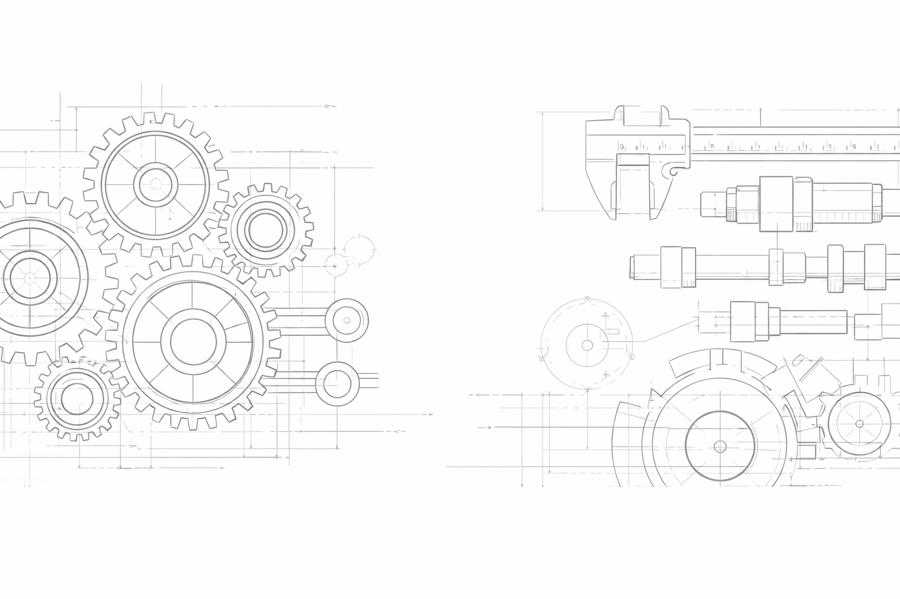

{ style="border-radius:12px" }

# BridgeZhang

## Mechanical Engineering Notes

Precision · Engineering · Thinking

[Start Reading](mechanical/index.md){ .md-button .md-button--primary }
[GitHub](https://github.com/bridgezhang){ .md-button }

---

## About This Site

This website records my learning and thinking in mechanical engineering.

Topics include:

- Mechanical design
- Tolerance and precision
- Engineering experience
- Professional growth

The goal is to build a long-term **engineering knowledge base**.

---

## Knowledge Areas

-   ⚙️ **Mechanical Design**

    ---

    Principles and case studies of mechanical design.

-   📐 **Tolerance & Precision**

    ---

    Fits, tolerances and precision engineering.

-   🧠 **Engineering Thinking**

    ---

    Long-term professional development.

-   🛠️ **Tools & Methods**

    ---

    Engineering tools and workflows.

---

## Latest Notes

- [Mechanical tolerance fundamentals](mechanical/index.md)
- [Engineering documentation methods](mechanical/index.md)
- [Learning roadmap for mechanical engineers](mechanical/index.md)

---

## Philosophy

Engineering is not only about solving problems.

It is about building structures that last.

Just like a **bridge**.